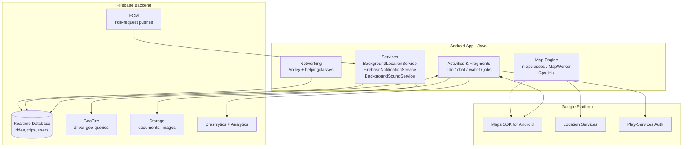

<p align="center">
  
</p>

<p align="center">
  
  
  
  
</p>

> **Developed by [Arslan Malik](https://github.com/arsalanmaalik461)**
> 📱 WhatsApp: [+92 300 8987448](https://wa.me/923008987448) · 🌐 Website: [arslanmalik.tech](https://arslanmalik.tech)

---

## 🌟 Executive Overview

**ApnaDriver Rider Cream Clone** is a native Android **driver-side ride-hailing app** written in Java — the kind of complete, dispatch-driven "driver app" that powers Careem-style services: riders' trip requests arrive as push notifications, drivers go online, accept, navigate pickup → drop-off, and get paid, all from one codebase.

Under the hood it is a Firebase-first architecture: **Firebase Realtime Database** carries live ride state and driver geo-positions (via **GeoFire**), **Firebase Cloud Messaging** wakes the app for new requests, **Storage** holds verification documents, and **Crashlytics/Analytics** keep an eye on production health. Maps are fully Google — Play Services Maps/Location, android-maps-utils, and an animated `mapclasses` engine that interpolates the driver's marker, draws routes, and places custom pickup/drop-off pins. This repository currently ships the **Driver Android source** (package `com.qboxus.gograbdriver`, v1.1); a rider-side app would pair with it over the same backend.

---

## 📑 Table of Contents

- [✨ Key Features & Highlights](#-key-features--highlights)
- [🖥️ Feature Showcase](#️-feature-showcase)
- [🏗️ System Architecture](#️-system-architecture)
- [🚀 Quickstart & Installation Guide](#-quickstart--installation-guide)
- [📂 Project Structure](#-project-structure)
- [🛡️ Security & Notes](#️-security--notes)

---

## ✨ Key Features & Highlights

| Feature | Description |
| :--- | :--- |
| 📲 Real-Time Ride Requests | FCM push + background sound service with an audible ringtone alert when a new trip request arrives |
| 🗺️ Live Map & Route Engine | Animated driver marker, route evaluation, custom pickup/drop-off/current-location pins (`mapclasses/`) |
| 📍 Background Location Tracking | `BackgroundLocationService` streams driver position continuously (GeoFire-compatible geo-queries) |
| 💬 In-App Chat | Text + **voice-note** chat module between driver and rider (audio-wife, record-view) |
| 💰 Wallet & Earnings | Wallet fragment, trip payment model, earnings dashboard with MPAndroidChart graphs |
| 📄 Driver Document Verification | Upload/manage license & vehicle documents (Storage-backed document fragment) |
| 🚗 Vehicle Management | Add/edit vehicle details tied to the driver profile |
| 📦 Multi-Stop & Parcel Orders | Multi-stop rider orders, food/parcel order lists and detailed order screens |
| ⭐ Ratings & Feedback | Trip rating model, SimpleRatingBar-based feedback flow |
| 🔐 Multi-Channel Auth | Email/password, phone + OTP (pinview), Facebook Login, Google Play-Services auth |
| 🌍 Localization Ready | English + Arabic (`values-ar/`) string resources |
| 🧾 Job History | Completed-trip history, my-jobs list, order detail views |

---

## 🖥️ Feature Showcase

### 1. Ride & Request Flow

> *"Go online → hear the ring → accept → navigate → complete → get paid."*

- `rideandrequest/` fragments handle the full trip lifecycle: incoming request cards, pickup navigation, in-ride status, and completion/payment/ratings screens
- Firebase Realtime Database keeps ride state (`RideModel`, `TripModel`, `RideRequestModel`) in sync between driver and backend
- Animated map marker interpolation (`LatLngInterpolator`, `MapAnimator`) makes the driver's position glide smoothly on the map

### 2. Chat Module

> *"Talk it out without leaving the app."*

- Full text chat with view-holders for sent/received/alert bubbles (`chatmodule/`)
- Voice-note recording and playback via `record-view` and `audio-wife`
- Useful for coordinating pickup points and multi-stop orders in real time

### 3. Wallet, Earnings & Documents

> *"Everything a professional driver needs to stay compliant and get paid."*

- Wallet fragment with trip payment tracking (`TripPaymentModel`)
- Earnings dashboard with MPAndroidChart visualizations (`earningfragments/`)
- Document upload + management flow for license/vehicle verification (`documentfragment/`, `DocumentManageModel`, `PublishDocumentModel`)
- Vehicle management screen tied to the driver profile (`vehiclemanagefragment/`, `VehicleModel`)

### 4. Auth & Account Management

> *"Sign in your way, recover your way."*

- Email/password, phone-number + OTP verification (country picker, pinview)
- Facebook Login and Google Play-Services auth wired in
- Forgot-password flow, profile editing with phone/email re-verification, settings screen

---

## 🏗️ System Architecture



**Data flow:** the driver app stays online via `BackgroundLocationService` (position → Realtime Database/GeoFire). A rider's request arrives as an FCM push → `FirebaseNotificationService` → audible ringtone alert → accept → live map navigation → trip completion → payment recorded in the wallet and earnings dashboard.

---

## 🚀 Quickstart & Installation Guide

### Prerequisites

- **Android Studio** (Arctic Fox or newer; project targets AGP 7.1.1, compileSdk 31)
- **JDK 11** (required by Android Gradle Plugin 7.x)
- A **Firebase project** with Realtime Database, Cloud Messaging, Storage enabled — add your `google-services.json` to `app/`
- A **Google Maps API key** enabled for Maps SDK for Android, Places/Directions APIs

### Step-by-Step Installation

```bash
# 1. Clone the repository
git clone https://github.com/arsalanmaalik461/apnaDriver-Rider-Cream-Clone-.git
cd "apnaDriver-Rider-Cream-Clone-/Android source code/apnaDriver Driver"

# 2. Add your Firebase config
cp /path/to/your/google-services.json app/google-services.json

# 3. Put your backend/API details in Constants
#    app/src/main/java/com/qboxus/gograbdriver/Constants.java
#    → set BASE_URL and API_KEY (currently empty placeholders)

# 4. Put your Google Maps API key in the manifest / resources

# 5. Build & install (debug)
./gradlew assembleDebug
./gradlew installDebug
```

> **Note:** The app builds as `com.qboxus.gograbdriver` v1.1 (versionCode 2), minSdk 21 / targetSdk 31. `Constants.BASE_URL` and `API_KEY` ship empty — point them at your own dispatch backend before release.

---

## 📂 Project Structure

```
apnaDriver-Rider-Cream-Clone-/
├── README.md
├── docs/
│   └── assets/
│       └── banner.svg                 # project banner
├── documentation/
│   └── index.html                    # vendor documentation viewer stub
└── Android source code/
    └── apnaDriver Driver/            # ← the Android Studio project
        ├── app/
        │   ├── build.gradle          # dependencies: Firebase BOM, Maps,
        │   │                         # Volley, Fresco, MPAndroidChart…
        │   └── src/main/
        │       ├── AndroidManifest.xml
        │       ├── java/com/qboxus/gograbdriver/
        │       │   ├── activitiesandfragments/   # UI: accounts, chat,
        │       │   │   │                         # wallet, earnings, jobs,
        │       │   │   │                         # documents, settings…
        │       │   ├── adapters/                 # RecyclerView adapters
        │       │   ├── appinterfaces/            # callbacks & contracts
        │       │   ├── broadcastreceiver/
        │       │   ├── helpingclasses/           # API helpers, utils
        │       │   ├── mapclasses/               # route + marker animation
        │       │   ├── models/                   # RideModel, TripModel,
        │       │   │                             # UserModel, VehicleModel…
        │       │   └── services/                 # BackgroundLocationService,
        │       │                                 # FirebaseNotificationService,
        │       │                                 # BackgroundSoundService
        │       └── res/                          # layouts, values (+values-ar),
        │                                         # drawables, raw/ring_tone.mp3
        ├── build.gradle                          # AGP 7.1.1, google-services
        ├── settings.gradle
        └── gradlew / gradlew.bat
```

111 Java source files · 60+ layout resources · Firebase BOM 29.0.3 · Gradle wrapper included.

---

## 🛡️ Security & Notes

- **API endpoints are placeholders:** `Constants.BASE_URL` and `Constants.API_KEY` are empty in this snapshot — configure them for your own backend; never commit real keys.
- **Firebase config is not included:** add your own `google-services.json` (it is git-ignored by default); the repo ships no production credentials.
- **Permissions are broad by design:** the app requests fine/background location, camera, microphone, storage and wake-lock — these are required for dispatch, document upload, and voice chat. Review `AndroidManifest.xml` and request runtime permissions appropriately.
- **Third-party SDKs:** Facebook Login and Google Sign-In are wired in — supply your own app IDs/keys and OAuth consent configuration.
- **Demo doc link:** `documentation/index.html` loads an external vendor demo URL (`demo.qboxus.com`) inside an iframe; it is not part of the app build.
- This repository currently contains the **Driver** Android app only; a rider-side app pairs with it over the same Firebase/backend and is not included in this snapshot.

---

<p align="center">
  <sub>Developed with ❤️ by <a href="https://github.com/arsalanmaalik461">Arslan Malik</a> · 📱 <a href="https://wa.me/923008987448">WhatsApp: +92 300 8987448</a> · 🌐 <a href="https://arslanmalik.tech">arslanmalik.tech</a></sub>
</p>
